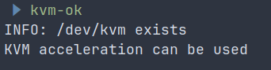
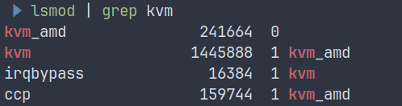

# Host Details:
OS: Ubuntu 24.04
Memory: 16GB
CPU: 16 (8 core, 2 threads / core)

---

# Tools needed in Host to create VM's
1. KVM: A Linux kernel module that turns your system into a hypervisor, enabling VMs to run with near-native performance by leveraging CPU virtualization features

2. QEMU: A powerful emulator that provides the virtual hardware (for example, CPU, disk, network) for your VMs, working with KVM for fast execution.

3. libvirt: A management layer that simplifies VM creation, networking, and storage, offering tools like virsh and APIs for automation.

Ref: https://www.freecodecamp.org/news/turn-ubuntu-2404-into-a-kvm-hypervisor/

4. vagrant: CLI tool for managing VM's
---

# Host Setup:
1. Check virtualization support

```
lscpu | grep Virtualization

# or

kvm-ok
```



2. Installing tools

```
# Update the system

sudo apt update && sudo apt upgrade -y
```

```
# Installing required tools

sudo apt install qemu-kvm libvirt-daemon-system libvirt-clients bridge-utils libvirt-dev -y
```
- qemu-kvm: Emulates hardware for VMs.
- libvirt-daemon-system: Manages VMs.
- libvirt-clients: CLI tools like virsh for hypervisor management.
- bridge-utils: For network bridging.
- libvirt-dev: Supporting files needed by vagrant


```
#  Verify that kvm is loaded
lsmod | grep kvm 
```


```
# Add user to the libvirt group to create VM without sudo

sudo usermod -aG libvirt $USER

# logout and log back in for this group change to take effect.
```

```
# Install Vagrant
wget -O - https://apt.releases.hashicorp.com/gpg | sudo gpg --dearmor -o /usr/share/keyrings/hashicorp-archive-keyring.gpg

echo "deb [arch=$(dpkg --print-architecture) signed-by=/usr/share/keyrings/hashicorp-archive-keyring.gpg] https://apt.releases.hashicorp.com $(grep -oP '(?<=UBUNTU_CODENAME=).*' /etc/os-release || lsb_release -cs) main" | sudo tee /etc/apt/sources.list.d/hashicorp.list

sudo apt update && sudo apt install vagrant

# Vagrant-libvirt is a Vagrant plugin that adds a Libvirt provider to Vagrant, allowing Vagrant to control and provision machines via Libvirt toolkit.

vagrant plugin install vagrant-libvirt
```
Ref:
https://opensource.com/article/21/10/vagrant-libvirt
https://vagrant-libvirt.github.io/vagrant-libvirt/


Start the vm's
```
cd vagrant
vagrant up

# suspend the machine
vagrant suspend server node-0 node-1

# to resume the suspended machine
vagrant resume server node-0 node-1
```

## Download the required binaries in jumphost (Local laptop terminal) to avoid redownloading the binaries
```
wget -q --show-progress \
  --https-only \
  --timestamping \
  -P downloads-binaries \
  -i downloads-$(dpkg --print-architecture).txt

# wget: The core command-line utility used to download files from the internet.

# -q: Stands for quiet. It suppresses all of wget's normal text output, logs, and error messages.

# --show-progress: Because -q hides everything, this flag brings back just the download progress bar. This combination gives you a clean visual without cluttering your terminal.

# --https-only: A security measure. It forces wget to only download from encrypted https:// URLs, actively ignoring or refusing any unencrypted http:// links.

# --timestamping: Also known as -N. It checks the timestamp of the remote files against your local files. It will only download a file if the remote version is newer than the one already on your computer, saving time and bandwidth.

# -P downloads: The prefix flag. It tells wget to save all downloaded files into a directory named downloads. If the folder doesn't exist, wget will create it.

# -i: Stands for input-file. Instead of providing a single URL on the command line, this tells wget to read a text file and download all the URLs listed inside it (one per line).

# $(dpkg --print-architecture): This is a bash command substitution. Before wget even runs, the terminal executes dpkg --print-architecture (a standard command on Debian/Ubuntu systems) to detect your system's hardware architecture (e.g., amd64, arm64, i386).
```

Ref for kubernetes binaries download url's:
https://www.downloadkubernetes.com/


## Organizing the downloaded binaries

```bash
{
  mkdir -p downloads-binaries/{client,cni-plugins,controller,worker}
  
  tar -xvf downloads-binaries/crictl-v1.35.0-linux-amd64.tar.gz -C downloads-binaries/worker/

  tar -xvf downloads-binaries/containerd-2.2.4-linux-amd64.tar.gz --strip-components 1 -C downloads-binaries/worker/

  tar -xvf downloads-binaries/cni-plugins-linux-amd64-v1.9.1.tgz -C downloads-binaries/cni-plugins/

  tar -xvf downloads-binaries/etcd-v3.6.12-linux-amd64.tar.gz -C downloads-binaries/ --strip-components 1 etcd-v3.6.12-linux-amd64/etcdctl etcd-v3.6.12-linux-amd64/etcd

  mv downloads-binaries/{etcdctl,kubectl} downloads-binaries/client

  mv downloads-binaries/{etcd,kube-apiserver,kube-controller-manager,kube-scheduler} downloads-binaries/controller

  mv downloads-binaries/{kubelet,kube-proxy} downloads-binaries/worker
}

```

```bash
rm -rf downloads-binaries/*gz
```

Make the binaries executable

```bash
chmod +x downloads-binaries/{client,cni-plugins,controller,worker}/*
```

## Installing kubectl

kubectl is used to interact with kubernetes control plane.

```
cp downloads-binaries/client/kubectl /usr/local/bin
```

Verify the installation:
```
kubectl version --client
```